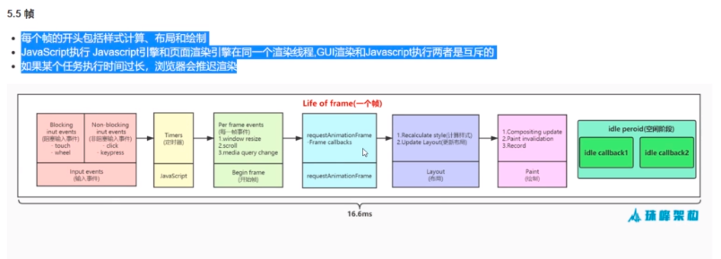

## 学习深入react技术栈
### 事件系统
合成事件主要做了两件事: 事件委派和自动绑定
- 事件委派
vdom 是在内存中以对象的形式存在,在这些对象上添加事件很方便.react并不是把事件绑定在真实的节点上,而是把事件绑定在最外层,使用一个统一的监听器,监听器维持一个映射:组件内部的事件监听和处理函数,采用事件冒泡机制,冒泡到最外层节点,进行处理
- 自动绑定
react中每个方法的上下文都指向当前组件的实例
> react 事件是组件往父组建冒泡，不管元素dom的位置，可以参见react protal 用法，dom不存在子父关系的时候，也可以冒泡事件
### 组件通信
> 没有嵌套关系的组件
可以使用发布订阅/ redux
### 高阶组件
实现高阶组件有两种方式:
- 属性代理: 高阶组件包裹react组件来操作props
可以使用@高阶组件名书写
```javascript
const MyContainer = (WrappedComponent) => {
    // 函数返回一个组件
    class extends Component{
        render(){
            return <WrappedConponent />
        }
    }
}
@MyContainer    //高阶组件语法糖
class MyConponent extends Component{
    render(){
    }
}
```

- 反向继承: 高阶组件继承被包裹的react组件
```javascript
const MyContainer = (WrappedComponent) => {
    // 函数返回一个组件
    class extends WrappedComponent{
        render(){
            return super.render()
        }
    }
}
```

### purerender
react只对参数进行浅比较, 浅比较相同时候不会触发渲染
purerender 进行深比较

## React
React是用于构建用户界面的js库
能够通过组建化的方式构建快速响应的大型web应用程序

### 虚拟dom
优点：
处理了浏览器差异性，避免用户操作真实的dom
内容经过xss处理，防范xss攻击
容易跨平台
实现差异更新，减少dom操作
缺点： 
首次更新并不会快
占用内存

### 函数组建和类组建
怎么区分的： Component.prototype.isreactComponent = {}
不同：    
函数组建是函数式编程思想， 类组建需要创建实例，面向对象思想
类组建创建实例并保存，需要占用内存，函数组建不需要创建实例
函数组建方便书写单元测试
函数组建具有值捕获特性   使用定时器三秒后打印值  还是三妙前的数值，而类组建由于共享一个实例，打印的值是三妙后的新值
生命周期
跳过更新的方式不同 purecomponent  react.memo
类组建编译出来的代码多很多

### purecomponent
里面重写了shouldcomponentUpdate 
浅比较了oldstate  newstate   oldprops newprops 如果相同 就返回false 不更新组建

React渲染流程：
设计理念： 跨平台（虚拟DOM），快速响应（异步可中断+ 增量更新）
性能瓶颈： 浏览器刷新率是60Hz 大概16.6ms执行一次，然而js线程和渲染线程是互斥的，js线程执行时候超过16.6ms的话就会出现掉帧
React解决措施是；利用空闲时间更新，不影响渲染进程进行渲染，把一个耗时间任务拆分成一个个小任务(fiber)

帧：
每个帧的开头包括样式计算，布局和绘制

requestIdleCalllback使得开发者能够在主事件循环上执行后台和低优先级工作，而不会影响延迟关键事件
正常帧任务完成后没超过16.6ms说明时间有空余，会执行requestIdleCallback里注册的任务
```
var handle = window.requestIdleCallback(callback[, options])
```
浏览器 render进程： https://www.qiyuandi.com/zhanzhang/zonghe/15793.html

请求动画帧 requestAnimationFrame 
与setTimeout相比，requestAnimationFrame最大的优势是由系统来决定回调函数的执行时机。具体一点讲，系统每次绘制之前会主动调用 rAF 中的回调函数,如果屏幕刷新率是60Hz,那么回调函数就每16.7ms被执行一次，如果刷新率是75Hz，那么这个时间间隔就变成了1000/75=13.3ms，换句话说就是，requestAnimationFrame的步伐跟着系统的刷新步伐走。它能保证回调函数在屏幕每一次的刷新间隔中只被执行一次，这样就不会引起丢帧现象，也不会导致动画出现卡顿的问题。

react 渲染原理 https://zhuanlan.zhihu.com/p/45091185