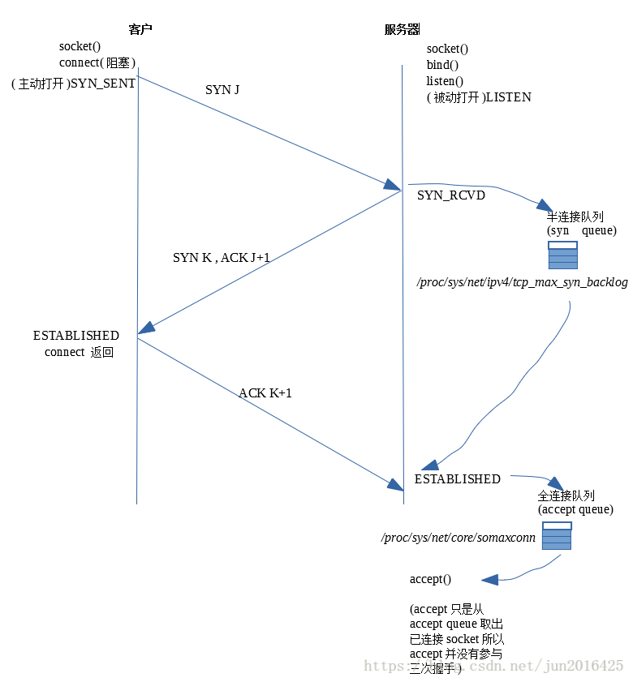

## 延迟和带宽
延迟(分组从信息员发送到目的地的所需的时间)
- 传播延迟 消息从发送端到接收端需要的时间,是传播距离和速度的函数
- 传输延迟 把消息中所有的比特转移到线路中需要的时间
- 处理延迟 处理分组首部 检查位错误以及确定分组目标所需的时间
- 排队延迟 到来的分组排队等待的时间
查看可以使用 traceroute命令
CDN网络最重要的就是通过把内容部署到全国各地,让用户从最近的服务器加载内容,大幅降低传播分组的时间
带宽(逻辑或者物理通信路径最大的吞吐量)

## TCP的构成
TCP负责在不可靠地传输信道上提供可靠的抽象层,向应用层隐藏了大多数网络通信的复杂细节,
比如丢包重发,按序发送,拥塞控制及避免,数据完整等,采用TCP数据流能够确保发送的所有字节能够
完整的被接收到,而且到达客户端的顺序也一样
注: HTTP并没有规定TCP就是唯一的传输协议,如果你愿意,使用UDP或者其他协议也OK

### 三次握手

三次握手完成后,客户端和服务器就可以通信了,客户端可以在发送ACK分组之后立即发送数据, 而服务器必须等到接收到
ACK分组之后才能发送数据. 这个启动通信是所有使用TCP都需要的过程,具有非常大的性能影响
在距离相当远的情况下(延迟就高),三次握手的时间就比较长,每创建一个TCP连接的代价就很高,这就要求想办法复用连接

### 拥塞预防和控制
#### 流量控制
预防发送端过多的向接收端发送数据的机制,否则,接收端可能因为忙碌/负载重/缓冲区既定而无法处理. 为实现流量控制,
TCP连接的每一方都需要通告自己的接受窗口(rwnd),其中包含能够保存数据的缓冲区空间大小信息

第一次建立连接的时候,双方都会使用自身系统默认设置发送rwnd,浏览器请求服务器向客户端下载数据, 客户端窗口更可能称为瓶颈,
上传图片或者视频时候,服务端窗口更可能成为瓶颈, 不管怎样, 其中一端跟不上数据传输,那他可以向发送端通告一个较小的窗口,
假如窗口为零,必须由应用层先清空缓冲区,在接受剩余数据
窗口缩放信息查看: sysctl net.ipv4.tcp_window_scaling

#### 慢启动
发送端和服务端在连接建立之初,谁也不知道可用带宽是多少,因此需要一个估算机制,然后根据网络中不断变化的条件动态改变速度

